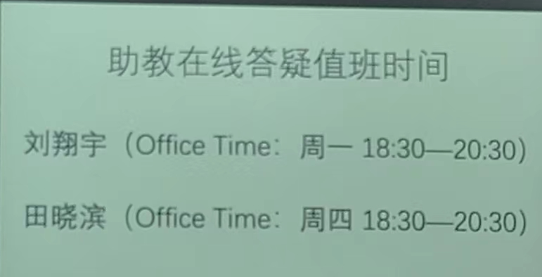
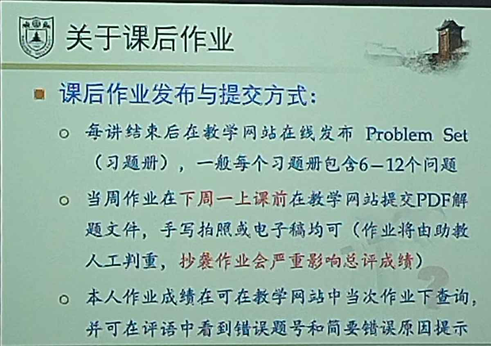
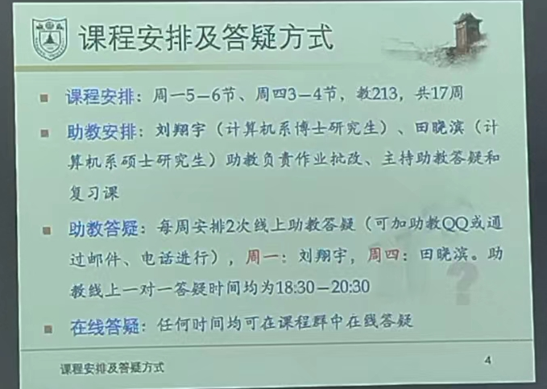

# #吴楠

**主教材：《离散数学及其应用》（第8版）**

* 吴楠教授

  * email: nwu@nju.edu.cn
  * 办公室：仙林校区计算机楼304办公室
  * office time: 在线发邮件，任何时间
  * **教学网站：计算机学科本科教学支撑平台：http://cslabcms.nju.edu.cn/**
* 主教材资源：

  * mhhe.com/rosen 在线学习中心

# 关于作业和考试

* ​​​

  ​​​
* 总评成绩：平时作业30%，期中测验20%，期末考试50%

# 什么是数学 · 离散数学

* 人类认知分层理论之一——由下到上不同层次：

  科学（自然、社会科学）：简单地说，科学就是实证。-> 哲学：（**形而上学（对数学尤其重要）** /认识论和方法论/伦理与道德） -> 艺术（对宇宙、世界中美的反映）->宗教（广义的：本体论和终极关怀，人生终极三问）

  各个阶段没有明确界限

  * “数学不是科学”：公理不可实际证明或证伪，以此建立数学体系。
  * 神学阶段：宗教==>艺术
  * 抽象阶段：艺术==>哲学
  * 实证阶段：哲学==>科学
  * 数学可以含入各个层级，主要是自然科学，由形而上学下降而来。
  * 数学：判天地之美，析万物之理。
* 各层次的研究对象

  * 最大范畴：天（大宇宙）
  * 地（中宇宙）——自然界
  * 人（小宇宙）
* 科学艺术不可分；数学是美学的一部分。数学是抽象和简化——模型。
* 数学：公理体系+演绎推理 vs 经验科学：事实+归纳推理

  数学与其他科学都不一样，是从理论和认知出发的。

  * 公理是数学体系的起点。

    * 欧氏几何：五大公理。
    * **人工智能虽为工科，却不能止步于实测实验，而必须有演绎证明才完备**。
  * 凡所有相，皆是虚妄。若见诸相非相，即见如来。
* 数学的定义

  * 是逻辑学。——罗素
  * 是形式系统。——希尔伯特
  * 是心灵的直觉。——布劳威尔
* **离散数学：研究**​**<u>离散对象</u>**​**的数学分支。** 互补的是连续数学。

  离散：有联系，但是不黏着。

  * 离散系统：如自然数集。连续系统：如实数集。例如：存在“0的下一个自然数”，但是不存在“0的下一个实数”

‍

# 如何学好这门课？

practice.practice.practice.
