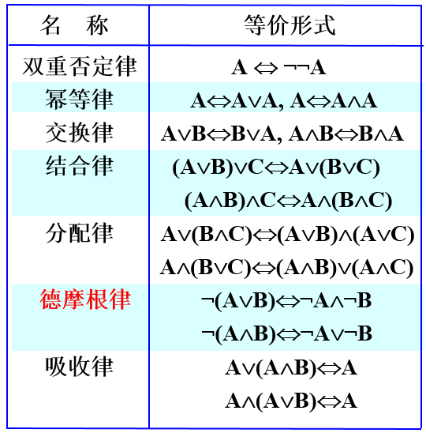
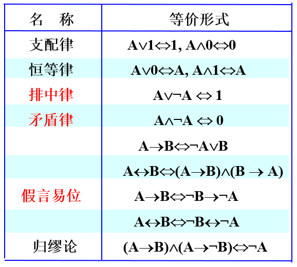
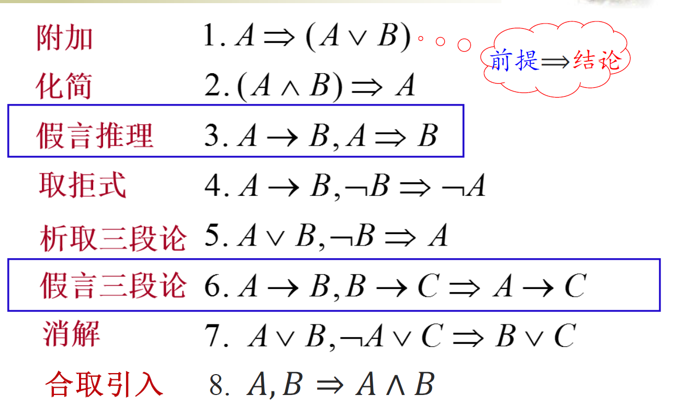
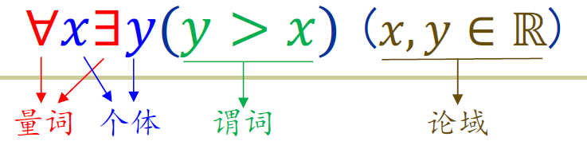

# #课程知识大纲

* 逻辑与证明

  * 1 命题逻辑初步

    * 定义：逻辑，命题，命题的值（真值），命题变元
    * 定义：命题联结词（最基本的5个），<u>命题表达式</u>，真值表

      真值表完整呈现命题联结词和表达式的语义
    * 定义：永真式（重言式）、永假式（矛盾式）、可能式（可满足式）及其关系

      注意：重言式是可满足式的一种，可满足式的对立面是矛盾式（老师PPT有小误差），一个表达式是可满足的当且仅当它是可满足式
    * 定义：<u>逻辑等价</u>、等值式，两个常用的蕴含等值式

      常用逻辑等价表

      * ​​​
    * 定义：（文字、简单合取式、简单析取式、析取范式、合取范式、）范式
    * 证明：范式存在性定理，四条判定定理（简单析取式的永真性判定、简单合取式的永假性判定、析取范式的永真性判定、合取范式的永假性判定），<u>（命题逻辑系统的）可判定性</u>

      个人理解：可判定性，即说明任意命题表达式通过转化为范式能够判断其为永真/永假/可能式，且若为可能式，在知道范式中所有命题变元的真假后可以判断该式的真假
  * 2 命题逻辑的推理理论

    * 定义：三种主要的逻辑推理方式
    * 定义：逻辑推理系统、命题逻辑推理系统

      利用逻辑系统中已有的前提以及推理规则经过给定的推理过程产生结论的系统
    * 定义：*公理推理系统（公理/定理+推理规则->定理）
    * 定义：自然推理系统（判定+推理规则->有效推论），8条推理规则

      * ​​
    * （概念辨析：语义蕴含、语法蕴含、实质蕴含）

      * 语义蕴含$\vDash$是指通过真值表可以从前件为真推出后承为真，语法蕴含$\vdash$是指通过推理规则从前件为真推出后承为真

        两者都是推理中所用符号
      * 实质蕴含就是<u>命题联结词</u>蕴含$\rightarrow$​
      * $\Rightarrow$没有明确定义，主要在自然推理系统中使用时等同于语法蕴含
    * *证明：命题逻辑系统的完备性、可靠性

      完备性：若能语义证明，则能语法证明；可靠性：若能语法证明，则能语义证明
  * 3 谓词逻辑引论

    * <u>定义：谓词（命题函数）、个体（个体变元），量词（存在量词、全称量词）、论域</u>

      形式语言表达：​
    * 定义：含量词的自然推理系统、谓词逻辑的公理系统

      （分别在命题逻辑自然推理系统、公里推理系统基础上添加4条规则/公理）
    * *证明：一阶谓词逻辑推理系统（FOL）的性质

      完备性、可靠性、不可判定性
  * 4 证明导论

    * 定义：证明

      > 实验科学的证明是归纳性的，不产生定论，产生定律（law）；数学使用演绎推理，产生定论，定理（theorem），又称数学定论（mathematic certainty）；数学中归纳仅用于猜想规律产生假设
      >
    * 定义：形式化证明（formal proof，又称推导 derivation）
    * 定义：推理有效/推理正确
    * 基本证明方法（直接证明法、反证法和归谬法、空证明（前件假证明法）和平凡证明（后件真证明法）、等假证明法、反例证明法）

      > 空证明的典例：证明空集是任何集合的子集
      >
      > 平凡证明的典例：数学归纳法中的奠基（先证明一些n的简单取值情况下要证的<u>条件命题</u>为真）
      >
    * 其他证明方法（穷举证明法/分情形证明法）
  * 5 集合论导引
  * 6 二元关系

    * 定义：有序n元组，序偶（有序2元组；用集合来构造），笛卡尔积
    * 证明：笛卡尔积的空律、有条件交换律、分配律
    * 定义：二元关系（简称关系）及其记号，二元关系的子分类（A到B的二元关系，A上的二元关系（空关系，全关系$E_A$，恒同关系$I_A$）），二元关系的属性（定义域，值域，域）
    * 定义：关系矩阵$M_R$和关系图（有向图）
    * 定义：关系的运算（逆，复合，n次幂（仅对于A上的二元关系有定义））
    * 定义
  * 7 关系的性质

    * 定义：自反性（关系R在A上是自反/反自反/非自反的）
    * 证明：自反的充要条件
