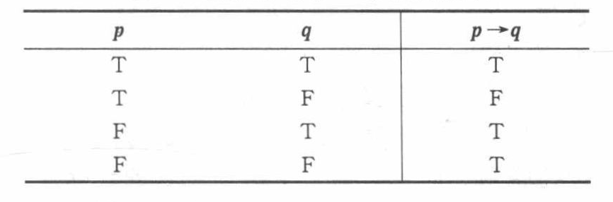
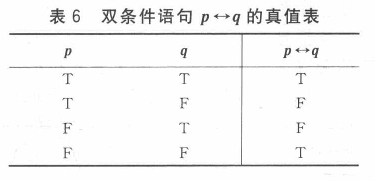

# 01命题逻辑初步

（推理系统使用的语言）

# 具体内容

元数学 Metamathematics：在数学之上更基本的

* 逻辑与证明
* 集合论

* 两大支柱

  * 演绎推理-形式逻辑
  * 归纳推理-科学实验

命题逻辑初步 20230914

* **定义：逻辑**——研究某个<u>形式语言</u>的<u>有效推论</u>

  什么是有效推论？

  * 使问题描述得严谨无歧义
  * 引导人们通过推理获得事物本质
* **定义：命题（命题本身只能用自然语言定义，无法用数学定义，因此并不严格）**

  命题是一个**陈述句**；

  一些字或其他符号组合成的一种形式，该形式所表达的**要么为真，要么为假**。——罗素 ……罗素*Principia Mathematica*

  > 是命题的例子：哥德巴赫猜想（因为非真即假，必然存在判断）
  >
  > 不是命题的例子：你会说英语吗？我们走吧！3-x=5（x未定义）“我现在说的是假话。”（不是命题，非真非假，是悖论）他是个多好的人呀！（不是陈述句，且不能客观判定真假）
  >

  * 语法（syntactic/syntax）、语义、语用
* 命题联结词：否定$\neg$、合取$\wedge$、析取$\vee$、蕴含$\rightarrow$、双蕴含$\leftrightarrow$……

  * 蕴含：$p\rightarrow q$即p蕴含q是一个复合命题，可文字表述为“若p，则q”，“P仅当q”等。**说的是p是q的充分条件，若p为真则q必须为真，但p为假则q真假都无所谓**。

    ​​

    e.g. “**只有**是计算机系师生(p)**才**能参加本次迎新晚会(q)”，是必要形式的表述，“p是q的必要条件”，即“q是p的充分条件”，因此本命题可以表示为$q\rightarrow p$

    e.g. “**只要**是计算机系师生(p)**就**能参加本次迎新晚会(q)”，是充分形式的表述
  * 双蕴含：可文字表述为“p当且仅当q”“p与q等价”

    ​​
  * 蕴含、双蕴含一定要区分！！！
* **定义：命题表达式**

  * 命题变元p,q,...为命题表达式
  * 若p,q为命题表达式，则$\neg p, p\wedge q, p\vee q, p\rightarrow q, p \leftrightarrow q$​均为命题表达式。
  * 命题表达式仅限于上述。
* **自然语言命题的形式化**

  * ex. p，你做完了作业；q，你可以玩游戏，那么“你不做完作业就不能玩游戏”表示为$\neg p\rightarrow \neg q$。那么，如果你做完了作业，是否可以玩游戏？

    另：由逆否定理可以等价于$q\rightarrow p$。
  * **定义：真值表，指派**
  * 制作命题真值表时，有成真指派、成假指派，指的是导致复合命题真值为真或假的参与运算的命题真值组合。
  * **真值表的作用：用计算表达推理**。

    难度：真值表的长度关于参与运算的命题数指数级增加。
  * 公式按指派中真值情况分类

    * 永真式
    * 矛盾式
    * 可能式
* 逻辑等价

  * 不太直观：蕴含等值式 $A\rightarrow B \Leftrightarrow \neg A\vee B$​
  * 蕴含等值式、假言易位式很长用
  * **证明逻辑等价的两种方法**：①语义推导（用真值表穷举证明） ②语法推导（用公式形式语言等价变形）
  * 蕴含重言式：$A \rightarrow B \Leftrightarrow T$则左边的蕴含式为蕴含重言式。

$$

$$

‍
