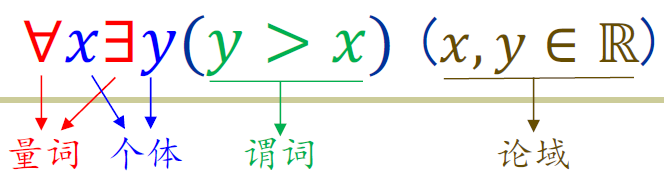

# 1 命题逻辑和谓词逻辑

# 命题逻辑的基本定义

* @命题：必取真、假之一的表述（可判定真假）

  > 注：如3-x=5这类不能算命题（无法判断真假），除非给x以具体的约束条件。
  >
* 命题变元
* @命题联结词（5个），真值表，命题表达式

  **命题的定义、联结词和真值表都是元数学的**。用于严谨抽象并呈现自然语言中的逻辑。

  * 命题联结词：最基本的——否定、<u>合取</u>（与：“合”就是同时成立的意思！）、析取（或）、蕴含、双蕴含（即等价）

    > “蕴含”最难理解。“$p\to q$”的真值是“由$p$能推出$q$”的真值。真命题推出的不能是假命题，因此只有$T\to F$值为$F$。
    >
  * 命题表达式：**递归定义**
* @永真式（重言式），永假式（矛盾式），可能式（可满足式）
* **@逻辑等价**

  *  **~常见的逻辑等价式**；最重要两个：假言易位$p\rightarrow q \Leftrightarrow \neg q \rightarrow \neg p$，蕴含等值$p\rightarrow q\Leftrightarrow \neg p \vee q$

  > 一些逻辑等价式很基础、通过直接验证真值表得到；另一些由这些推理出来。
  >
* @文字、简单合取/析取式、（合取、析取）范式

  > 文字：单个命题变元及其否定
  >
  > 简单合取式：仅由若干文字通过合取联结的命题表达式
  >
  > 合取范式：**若干简单析取式通过合取联结在一起！（“范”指外部框架）**
  >

  * ~**范式存在性定理：任何命题公式存在与其等价的合取、析取范式**

    > 先通过命题等值演算消掉蕴含、双蕴涵；
    >
  * ~简单合取/析取式，范式的**永真/永假性判定**

    > 命题逻辑系统是**可判定的**，是指任何命题表达式可以化成范式，进而**判定其永真/永假性**。
    >

# 命题逻辑推理系统

|要素名称|公理推理系统|自然推理系统|
| -----------| --------------| --------------|
|前件/前提|定理|判定|
|后件/结论|定理|有效推论|

* @*命题逻辑的公理推理系统
*  **@**​**命题逻辑的自然推理系统 8条推理规则**
* <u>~*命题公式的</u>​<u>**推理证明**</u>​<u>等价于它的等价变换证明（命题等值演算）、语义证明（用真值表验证）</u>

  等价变换证明：若$p\leftrightarrow q$永真，则$p\Leftrightarrow q$（逻辑等价）。

  类似地，推理证明：若$p\rightarrow q$永真，则$p \Rightarrow q$（逻辑推理）。

  由此发现逻辑等价和逻辑推理都**基于对应的永真式，作用都是证明两个命题表达式的真值一致性**（等价变换证明下前后两表达式真值情况完全一致，而推理证明下只保证前表达式为真时后表达式为真），而逻辑推理的要求更低、更灵活，但总体来说等价变换和推理两种证明方式是等价的。

  可以分别证明，（①）等价变换证明、（②）推理证明的方式与（③）语义证明的方式等价。其中②与③的等价包含两方面的性质：**完备性（**​**$③\Rightarrow②$**​ **）** 和**可靠性（**​**$②\Rightarrow ③$**​ **）** 。①与③的等价则可以从常见逻辑等价式出发进行数学归纳得到。
* 实质蕴涵：$\Rightarrow$。语法蕴含（运用推理得到）：$|-$，语义蕴含：$||-$（用真值表得到）。

# 一阶谓词逻辑推理系统

解决纯靠命题逻辑表达不精确的问题，将命题的构成要素再拆解。

* @谓词/命题函数：$P$，一个语句，形如$P(\Phi_1,...,\Phi_n)$

  个体：$P$的实参，即$x_1,x_2,...,x_n$

  **谓词不是命题，但传入实参在一些个体取定之后为命题**

  使用谓词的好处：针对一定范围（论域）内的个体，<u>按照相同的模板批量生成命题，还可以用量词限定个体的数量。</u>
* @量词，论域，量化命题

  ​
* 含量词的自然推理系统：新增4条推理规则

  > c是某个$P(x)$的论域中的个体，可以根据实际需要取定
  >

  * 全称例示UI：$\forall xP(x)\Rightarrow P(c)$
  * 全称生成UG：对于所有的$c,P(c)\Rightarrow \forall xP(x)$​
  * 存在例示EI：$\exists xP(x)\Rightarrow P(c)$（$c$必须是初次引入：因为只保证存在性，原有的个体不一定满足$P(x)$！
  * 存在生成EG：对某个$c,P(c)\Rightarrow \exists xP(x)$

* *一阶谓词逻辑推理系统是可靠的、完备的、**不可判定的**
