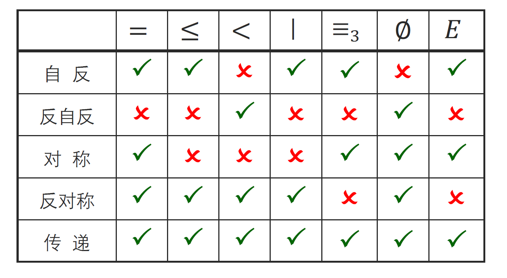
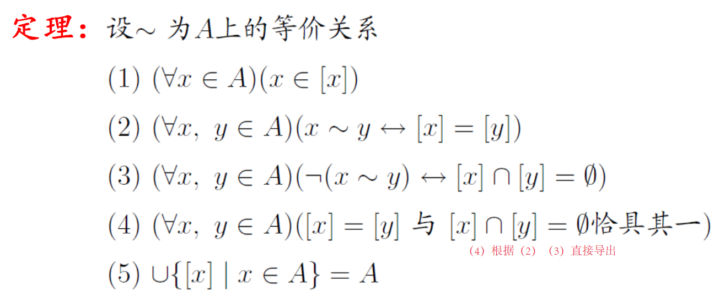

# 3关系的性质

* 三个基本性质

  > 性质所描述的对象：在$A$上的关系$R$（即$R\subseteq A×A$）
  >
  > **证明：[~]性质的定义、充要条件**
  >
  > * 自反：$\forall x\in A,xRx$
  >
  >   **$R$**​**自反当且仅当**​**$I_A\subseteq R$**
  > * 反自反：$\forall x\in A,\neg xRx$（**反自反与自反互斥但不对立**）
  >
  >   **$R$**​**反自反当且仅当**​**$R\cap I_A=\varnothing$**
  > * 非自反：$\exists x\in A,\neg xRx$
  > * 对称：$\forall x,y\in A, xRy\leftrightarrow yRx$（逆序偶一定成对出现）
  >
  >   **$R$**​**对称当且仅当**​**$R=R^{-1}$**
  > * 反对称：$\forall x,y\in A, xRyRx\rightarrow x=y$（除了$(x,x)$与自身，没有成对出现的逆序偶）
  >
  >   **$R$**​**反对称当且仅当**​**$R\cap R^{-1}\subseteq I_A$**($R$与其逆的交集是那些互逆的序偶，它们成对出现在$R$中，因此要约束它们只能是$(x,x)$型）
  >
  >   **反对称与对称并不互斥！（例如对于那些**​$R\subseteq I_A$，$R$都是既对称又反对称的）
  > * 非对称：$\exists x,y\in A, xRy\wedge \neg yRx$
  > * 强反对称：$\forall x,y\in A,xRy\rightarrow \neg yRx$（没有成对出现的逆序偶，$(x,x)$也不能出现）
  > * 传递：$\forall x,y,z\in A, xRyRz\rightarrow xRz$
  >
  >   **$R$**​**传递当且仅当**​**$R^2\subseteq R$**（$R^2$正包含那些通过一个中间元素联系起来的$x,z$即$xRyRz$）
  >
  >   表示为矩阵形式：$M_R\odot M_R\le M_R$（关系矩阵的**布尔积：只要找到**​$xRyRz$，就有$M_R(x;y)M_R(y;z)=1$从而$M_R(x;z)=1$​）
  >

  ​​
* 等价关系

  * 等价关系的定义：同时具有自反、对称、传递三大性质的$R\subseteq A\times A$​
  * 等价类：$[a]_R=\{b\in A|aRb\}$​

    * **[~]等价类的性质**

      * 等价类的每个元素都可以作代表元素：$aRb\to [a]=[b]$​

        证明：$aRb$则$bRa$，根据等价类的定义式$\forall x\in [a]$，$aRx\Rightarrow bRx\Rightarrow x\in [b]$，反之亦然

      ​​
  * （某集合关于某等价关系的）商集：$A/R=\{[a]_R|a\in A\}$

    $A$关于$R$的商集是$A$的一个划分；反之不然。
  * 划分：$A$的若干子集的集合，它的性质是：其各元素的并集为$A$；且其各元素互不相交。称各元素为**划分块**。
* 关系$R$的性质$P$​闭包

  * [~]$R$的$P$闭包（记为$S$）的定义：

    * 包含性：$R\subseteq S$​
    * $P$性：$S$具有$P$性（自反性/对称性/传递性）
    * 最小性：任何具有$P$性的$R$的超集$S'$，都有$S\subseteq S'$​
  * **$R$**​**的**​**$P$**​**闭包存在且唯一**

    * 唯一性：根据闭包的最小性$S_1$与$S_2$相互包含，所以$S_1=S_2$​
    * 存在性：$R$的$P$闭包的抽象构造：$S=\cap \{X|R\subseteq X且X具有性质P\}$（根据闭包的定义广义交的结果一定是具备最小性的，且同时具有包含性和$P$性）
  * [~]闭包的实用构造

    * 自反闭包：$R\cup I_A$​
    * 对称闭包：$R\cup R^{-1}$​
    * 传递闭包：理论上是$R$所有正整数幂的并，若$R$为有穷集则只需要并到$R^n$，其中$|A|=n$​
    * [~]传递闭包的$O(n^4)$和$O(n^3)$算法

      * $O(n^4)$算法：直接计算$M_R$，每执行一次乘法需要$O(n^3)$​
      * Warshall算法：

‍
