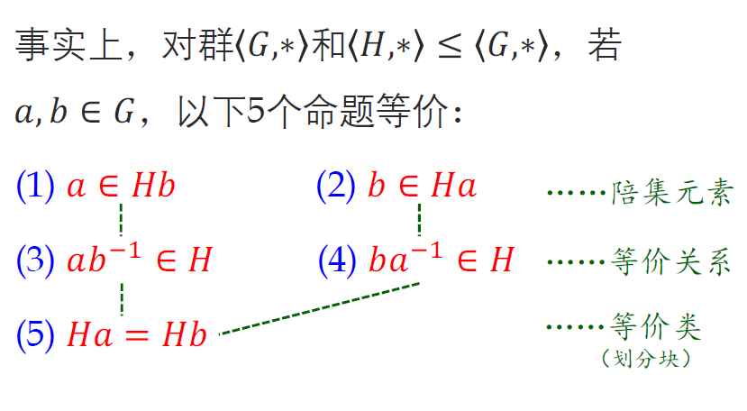

# 3子群与群的分解

# 基础定义

* **子群：已知群**​**$\langle G,*,e,^{-1}\rangle$**​ **，若**​**$H\subseteq G$**​**且满足：**

  > 应用：直接用子群的定义可以比较方便地判断$G$的一个子集$H$不是子群（只需要破坏下面一个条件即可。若要判断是子群，则用子群判定定理更方便）
  >

  * $\forall x,y\in H ,x*y\in H$（运算封闭）
  * $e \in H$（幺元封闭）
  * $\forall x \in H, x^{-1}\in H$（逆元封闭）

  则记$\langle H, *\rangle \le \langle G,* \rangle$（真子群用$<$）

  * $G$有两个平凡子群：$\langle e,*\rangle$和$\langle G,*\rangle$

# 子群的判定

## 子群判定定理

已知群$\langle G,*\rangle$，$H\subseteq G$，

以下4个命题等价：

1. $\langle H, *\rangle \subseteq \langle G,* \rangle$
2. $\langle H,*\rangle$为群
3. $H\ne \varnothing$且$\forall a,b\in H, a*b\in H$且$\forall a\in H,a^{-1}\in H$（**运算封闭、逆元封闭**）（由这两个封闭性自动导出幺元封闭）
4. $H\ne \varnothing$且$\forall a,b\in H,ab^{-1}\in H$（3的压缩版）

证明：

* 1->2：根据子群的定义子群满足封、结、幺、逆故为群
* 2->3：根据群的定义立得
* 3->4：显然（$a,b\in H,\therefore b^{-1}\in H, \therefore ab^{-1}\in H$）
* 4->1：

  > 因为$H\ne \varnothing$所以$\exists a,a \in H, aa^{-1}=e\in H$，所以$\forall a\in H,\exists e\in H,ea^{-1}=a^{-1}\in H$，所以$\forall a,b\in H,b^{-1}\in H, a(b^{-1})^{-1}=ab\in H$
  >
  > 综上$H$非空且满足三个封闭性（运算封闭、幺元封闭、逆元封闭）故为子群。
  >

## <u>有限子群</u>判定定理

* $G$为群，$\varnothing \ne H\subseteq G$且**$H$**​**为有穷集**，则$H$为$G$的子群$\Leftrightarrow$​$\forall a,b\in H,ab\in H$​

  （缩减为只需要运算封闭性即可！）
* 证明：

  > $\Rightarrow$：显然。
  >
  > $\Leftarrow$：设$|H|=n$。因$H$非空，$\exists a \in H$，
  >
  > <u>若</u>​<u>$a\ne e$</u>：
  >
  > ①**而对于任意一个**​**$a$**，有$a,a^2,...,a^n,a^{n+1}\in H$，**由鸽笼原理（核心：找出相同元素，从而利用母群的消去律证明子集对**​**$e$**​**的封闭性**）$\exist i,j(1\le i<j\le n+1),a^i=a^j\Rightarrow a^{j-i}=e$（两边乘若干次逆元）**将逆元成功表达为**​**$a$**​**的幂**，故$e=a^{j-i}\in H$。
  >
  > ②又即$aa^{j-i-1}=e$，因$0\le j-i-1\le n$故$a^{-1}=a^{j-i-1}\in H$；若$a=e$则显然$a^{-1}=a\in H$。
  >
  > 从而有：
  >
  > **③**​**$\forall a,b\in H, ab^{-1}\in H$**，根据子群判定定理$H$为$G$的子群，证毕。
  >

# 群中元素的阶

## 幂和阶的基础

* 群中元素$a$的幂$a^n$​的定义：

  * $n=0$时，$a^0=e$​
  * $n>0$时，$a^n$即$a$自乘$n$次的结果
  * $n< 0$时，$a^n=(a^{-n})^{-1}$（对应正整数幂取逆）
* 幂的运算性质（归纳法易证）：

  * $a^na^m=a^{n+m}$
  * $(a^n)^m=a^{nm}$
* 元素**的阶的定义**：

  * 若$\exists n\in \mathbb{N^+},a^n=e$，则使得$a^n=e$的最小$n$为$a$的阶数，并称$a$的阶有穷，$|a|=\min \{n>0|a^n=e\}$​
  * 否则称$a$的阶无穷，记为$|a|=\infty$​

## **<u>元素的阶的性质</u>**

设$|a|,|b|$有穷：

* $k\in \mathbb N^+, a^k=e\Leftrightarrow |a||k$

  > 证明：
  >
  > $\Leftarrow$：显然。
  >
  > $\Rightarrow$：作带余除法，$n=|a|$，$k=nq+r$，则$0\le r<n$，$a^k=a^{nq+r}=(a^n)^qa^r=e^qa^r=a^r=e$，因为$r<n$，则根据阶数的定义必有$r=0$即$|a|=n|k$。
  >
* $|a|=|a^{-1}|$

  > 证明：设$|a|=n$，则$a^n=e\Rightarrow e=(a^{-1})^n$，由上一定理知$|a^{-1}||n$；根据逆的相互性同理可证$|a|||a^{-1}|$，从而$|a|=|a^{-1}|$
  >
* **$|ab|=|ba|$**

  > 证明：若$ab$的阶有穷，则$|ab|=r$，则$ab=(ab)(ab)^r=(ab)^{r+1}=a(ba)^rb$，故由消去律知$e=(ba)^r$，从而$|ba|=r'$有穷，且$r'|r$；反过来同理可证$r|r'$，故$r=r'$。
  >
  > 若$|ab|=\infty$，则显然$|ba|=\infty$（否则若|ba|=r，则$(ba)^r=n\Rightarrow ba=(ba)^{r+1}=b(ab)^ra\Rightarrow e=(ab)^r$从而$|ab|=r$有限）
  >
* $|b^{-1}ab|=|a|$

  > 证明：根据前一定理$|b^{-1}(ab)|=|(ab)b^{-1}|=|a|$​
  >

应用：

* e.g.证明：群$G$中阶数$>2$的元素有偶数个

  > 因为$|a|=|a^{-1}|$，猜想阶数$>2$的元素成对出现，即$a\ne a^{-1}$。假若不然，$a=a^{-1}\Rightarrow a^2=e$与$|a|>2$矛盾！故得证。
  >

# 陪集与群的分解

> **子群将群分解为陪集**

## 陪集的基础定义

* 若有$\langle H, *\rangle \le \langle G,*\rangle$，$a\in G$，则$aH=\{ah|h\in H\}, Ha=\{ha|h\in H\}$分别为**子群**​$H$在$G$中的**左、右陪集**（来自$G$中的元素$a$陪在$H$的左边、右边）
* $H$在$G$中左（或右）陪集的个数，称为**$H$**​**在**​**$G$**​**中的指数**：$[G:H]$​

## 定理（陪集与划分）：子群$H$将母群$G$​<u>划分为陪集</u>

若$\langle H, *\rangle \le \langle G,*\rangle$，则有：

1. $He=H$

    > 根据陪集的定义，是显然的，$H$中每个元素乘$e$得自身放入$He$。
    >
2. $\forall a\in G,a\in Ha$故$\cup\{Ha|a\in G\}=G$

    > 因为$H$为子群，故$e\in H$，故$a=ea\in Ha$，从而$\cup\{Ha|a\in G\}=G$。
    >
3. **$\forall a,b\in G, Ha=Hb\vee Ha\cap Hb=\varnothing$**

    > 若$Ha\cap Hb\ne\varnothing$，则$\exist h_1,h_2\in H,h_1a=h_2b$，则$\forall h\in H,$​$a=h_1^{-1}h_2b\in Hb$（根据子群的逆元封闭性、运算封闭性和陪集的定义），则$ha=hh_1^{-1}h_2b\in Hb$，从而$Ha\subseteq Hb$，同理$Hb\subseteq Ha$，故$Ha=Hb$。
    >
4. ==$\{Ha|a\in G\}$==​==为==​==$G$==​==的划分==：根据2，3直接得到

## !定理（陪集相等的判定）

* 铺垫：先定义左、右陪集关系

  * 右陪集关系$R$：==$\forall a,b\in G, aRb\Leftrightarrow ab^{-1}\in H$==

    * $R$是等价关系

      > * 自反性：$aRa$，因为$aa^{-1}=e\in H$
      > * 对称性：$aRb\Leftrightarrow bRa$,，因为$ab^{-1}\in H\Leftrightarrow (ab^{-1})^{-1}=ba^{-1}\in H$
      > * 传递性：$aRb,bRc\Rightarrow aRc$，因为$ab^{-1}\in H,bc^{-1}\in H$，则$(ac^{-1})=(ab^{-1})(bc^{-1})\in H$
      >
    * 左陪集关系$R'$：改为$b^{-1}a\in H$
* 引理 **：若**​**$a,b\in G$**​ **，则**​**==$a\in Hb\Leftrightarrow ab^{-1}\in H\Leftrightarrow Ha=Hb$**==

  > 证明：
  >
  > * $a\in Hb\Leftrightarrow ab^{-1}\in H$
  >
  >   * $\Leftarrow$：显然。因为$ab^{-1}\in H\Rightarrow a=ab^{-1}b\in Hb$
  >   * $\Rightarrow$：由右陪集的定义，$\exists h \in H \ s.t.\ a=hb\Rightarrow ab^{-1}=h\in H$
  > * $a\in Hb\Leftrightarrow Ha=Hb$​
  >
  >   * $\Rightarrow$：$a\in Hb$，又因为$a\in Ha$，故$Hb\cap Ha\ne \varnothing$​$\Rightarrow$​$Hb=Ha$（由前面陪集与划分定理）
  >   * $\Leftarrow$：$a\in Ha,Ha=Hb,\therefore a\in Hb$
  >

* ==$[a]_R=Ha$==（$a$关于$R$的等价类正是右陪集$Ha$）

  > 证明：根据引理，$b\in [a]_R\Leftrightarrow bRa$（等价类的定义）$\Leftrightarrow ab^{-1}\in H\Leftrightarrow Ha=Hb\Leftrightarrow b\in Ha$（由陪集与划分定理2，3），故$[a]_R=Ha$。
  >

  * 以上等价条件的结构梳理：

    ​​

## Lagrange定理

* 引理：**==陪集的等势性：==**​**==$H\approx Ha\approx aH$**==

  > 证明：$\tau:H\to Ha$，其中$\tau(h)=ha$，由消去律，$\tau(h')=\tau(h)\Leftrightarrow h'a=ha\Leftrightarrow h'=h$，故$\tau$为单射；又由陪集的定义当$h$取遍$H$的元素时$\tau(h)$也取遍$Ha$的元素，故$\tau$为满射，从而**$\tau$**​**为双射**，故$H\approx Ha$，同理可证$H\approx aH$。
  >
* Lagrange定理：**<u>根据陪集的等势性引理和陪集与划分定理</u>**。据此可知，划分$\{Ha|a\in G\}$的每个划分块大小都是$|H|$，划分块的个数是$H$在$G$上的指数，因此得到Lagrange定理：若$G$为有限群，$H$为其子群，则

  $$
  |G|=|H|[G:H]
  $$

  **==子群的阶是原先群的阶的因子==**
* 推论1：$G$为有限群，$a\in G$，则$|a|\ | \ |G|$（**元素的阶数是群的阶数的因子！** ）

  > 证明：$|a|$有穷（否则$a$通过自乘能产生$G$中无限个元素），**显然**​**$\langle \langle a\rangle ,*\rangle \le \langle G,*\rangle$**，则$|a|=|\langle a\rangle |\ |\ |G|$（因为$a$的生成子群$\langle a\rangle =\{e,a,a^2,...,a^{|a|-1}\}$）
  >
* 推论2：若$|G|=p$为素数，则$\exist a\in G,\langle a\rangle =G$​

  > 可取得$e\ne a\in G$，则$|a|\ge 2$且为$|G|$的因子，故$|a|=p$，从而$|\langle a\rangle|=p=|G|$，故得证。
  >

‍
