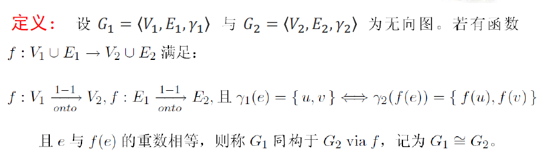
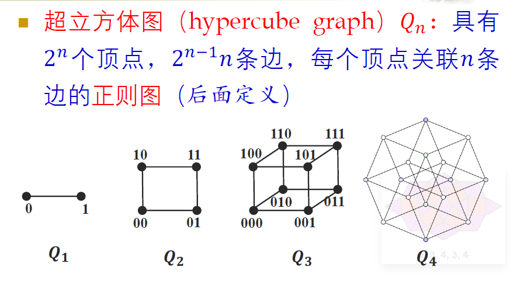

# 1图论的基础定义和术语

# 无向图

* @**无向图**​$G=\langle V,E,\gamma \rangle$，点集，点，边集，边，$\gamma:E\to \{\{u,v\}|u,v\in V\}$​

  **$\gamma$**​**通常可以省略**

  > $\gamma$的意义：在存在重边、自环时不能直接用集合$\{u,v\}$直接确定边，此时用$\gamma$将边名映射为其关联的点更准确。
  >

  * @端点，重边，重数，环（自环）
  * ==@==​**==多重图：有重边==**​<u>**==但无环==**</u>
  * @简单图：无重边且无环
  * @伪图：有重边或有环，即非简单图

# 有穷无向图

* @**有穷无向图**​**$G$**​

  > 最常讨论的图。
  >

  * @点集$V_G$，边集$E_G$，点数$v_G=|V_G|$，边数$e_G=|E_G|$
  * @$n$阶图：$v_G=n$​
  * **对于简单图**​$G$  **@** 满足$v_G=n,e_G=m$则称为$(n,m)$图
  * @标定图
  * @$u,v$相邻记为$u-v$，称该边$e$与$u,v$关联
  * @图的操作（得到一个新的图）

    * 去一边$G-e$​
    * 去一点及其关联边$G-v$​
    * 加一边$G+(u,v)$
    * 边收缩$G\cdot e$
    * 其他：图的并，交，差，**环和（对称差）**

# 点边关系和顶点的度

* @边与顶点关联，点与点、边与边相邻
* @度

  * $d(v)$：与$v$关联的边数，其中$v$的自环为特例，记为2度

    > 可以视为连在$v$上的“半条边”的数量。
    >

    **<u>一定要注意：增、删顶点对于图的度数和的总贡献不只限于该点本身，还有对其他顶点的度的影响！</u>**
  * 最大度$\Delta(G)$，最小度$\delta(G)$​
  * **入度**​**$d^-(v)$**​ **，出度**​**$d^+(v)$**
  *  **@度序列：将图各顶点度排成一列，默认要求为**​**<u>非递增序列</u>**

* @子母图$G=\langle V,E\rangle, G'=\langle V',E'\rangle$满足$V'\subseteq V,E'\subseteq E$。特别地$V'=V$时$G'$称为$G$的生成子图

# **图同构**

$G_1\cong G_2$

* ​​
* ~同构图的顶点数、边数、度序列必相同；反之不然。
* @图的矩阵表示

  * @邻接矩阵

# 特殊的**简单图**的记号

* $n$阶零图$N_n$
* 线图$L_n$（有$n$个顶点）
* 圈图$C_n$（$n$个点围成圈）
* **轮图**​**$W_n$**​ **（**​**==$n+1$**==​**==个点==**，其中$n$个围成圈，另外一个与它们都相邻）
*  **（无向）完全图**​$K_n$​
* $k$-正则图（$\forall v \in V, d(v)=k$）

  * ~根据握手定理，满足$2e_G=\sum d(v_i)=v_Gk$​
* 超立方体图$Q_n$：是一个$n$-正则图

  * ​

    边数的递推式：

    $$
    e_{n+1}=2e_n+v_n=2e_n+2^n
    $$
* @**简单图**​**$G$**​**的**补图$\bar G$​
* @**二部图（偶图）**​$G=\langle V_1,V_2,E\rangle$：**要求是无向图，**​**<u>不必是简单图</u>**

  $V_1,V_2$两部不能随意交换顺序！

  * 完全二部图$K_{|V_1|,|V_2|}$：必须是一个简单二部图

# 顶点度的数量特征相关定理

* **==~握手定理（图论第一定理）==**

  * ==~推论：任意图中奇度顶点个数为偶==
* ~$n$阶无向简单图中$\Delta(G)\le n-1$

# 图模型的应用（实际解决图论问题时的构建思路）

* 构建系统的状态转移关系：每个点是一个状态，点间连边当且仅当状态间有合法的转移方式
* 二部图：两组点是两类不同的对象，边存在当且仅当两对象中有某种特定意义的关联

‍
