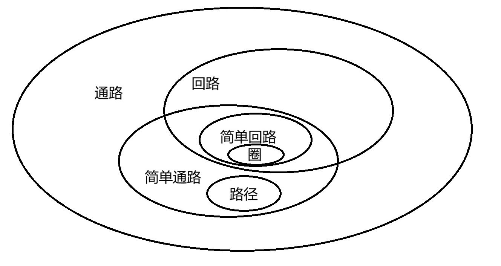
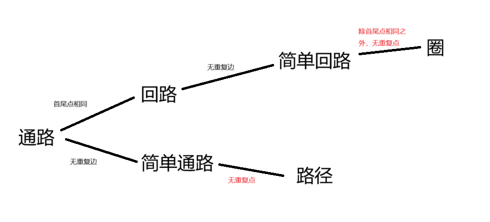
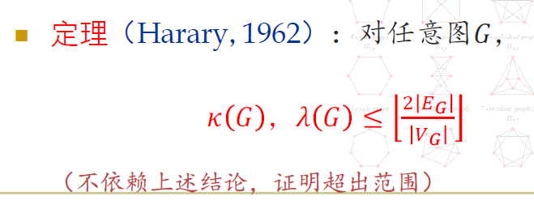
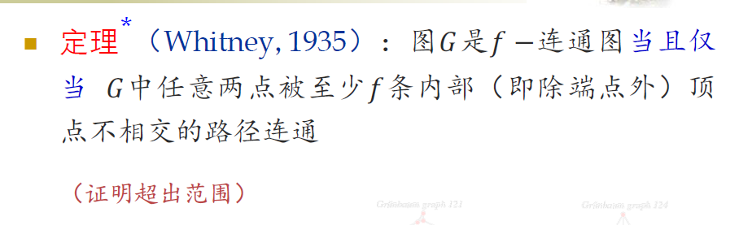

# 2无向图的连通性

# 通路和回路的定义

* @通路：是点、边交替的序列，且起始于点、终止于点，相邻的点和边相互关联。$\Gamma = v_0e_1v_1e_2...e_lv_l$
* @回路（一种特殊的通路）：$v_0=v_l$的通路$\Gamma$记为回路$C$，长度为回路上点的数目（计重数）即$l$
* @简单通路 simple path：通路中**所有边各异**

  @简单回路（一种特殊的简单通路）：$v_0=v_1$的简单通路
* @初级通路（路径） elementary path：$\Gamma$中各边、**点**均各异

  @初级回路（圈）：**$C$**​**中边各异，且除**​**$v_0=v_l$**​**外其余点各异**

> **根据定义简单通路包含简单回路，但**​**==初级通路不包含初级回路==**​==！==

* 概念辨析

  * ​​
  * ​​

# 通路基本定理

* ~通路存在性定理：$n$阶图$G$中$v_i,v_j$间存在通路$\Gamma$，则它们间存在**<u>长度不超过</u>**​**<u>$n-1$**</u>​**<u>的</u>**​<u>通路</u>​<u>$\Gamma'$</u>​

  > 根据鸽笼原理，只要存在的通路长度$>n-1$，则通路上一定有重复的点，可以将两个重复的点之间的部分删去，直到删减的通路长度$\le n-1$​
  >
* ~推论：路径存在性定理：上述条件导出——它们间存在长度不超过$n-1$的路径。

  > 只要原定理的通路中有重复的点，就可以继续执行操作直到没有重复的点，自然也就没有重复的边，此时得到路径且其长度不超过已经证明存在的通路$\Gamma'$的长度，即不超过$n-1$​
  >

# 无向图连通性的定义

* @无向图顶点间的连通关系$\sim$：定义在$V$上的等价关系

  > 辨析：连通与可达。对于不同的顶点$u,v$，它们间连通即可达，即之间存在通路。**对于一顶点**​**$u$**​ **，规定它与自身连通，但不是可达的，除非有自环。**
  >

  @无向图的连通性（无向图$G$​是连通的$\Leftrightarrow$​$\forall u,v \in V(G), u-v$ $\Leftrightarrow$​$G$为连通图）

  > 特别地，约定**平凡图（即**​**$N_1$**​ **）为连通图**。
  >

  @**连通分支**：商集$V/\sim=\{V_1,...,V_k\}$的各子集与子集中各点关联的边构成的子图（即诱导子图）$G[V_i]$称为$G$的连通分支，连通分支的计数$p(G)=|V/\sim|=k$
* @==点割集，割点，==​ ==**（边）割集**==​==，割边（桥）==

  * 点割集：$\varnothing\ne V'\subset V$，$p(G-V')>p(G)$，且$\forall V''\subset V', p(G-V'')=p(G)$

    > 特别规定（？）：除了将$G$连通分支数增大，也可以是将$G$变为平凡图。
    >
    > 删单个点导致的连通分支数变化是不确定的，可能增大、不变、减小，只有增大时是割点。
    >
  * 割集：$\varnothing \ne E'\subset E$，$p(G-E')>p(G)$，且$\forall E''\subset E',p(G-E'')=p(G)$​

  简而言之：点割集的任意真子集或真超集都不是点割集，对边割集亦然

  注意：点割集、边割集都不要求$G$为连通图，但去除这些点/边会使$G$的连通分支数增加
* ==常见结论==

  * ~若$G$不连通，则$\bar G$连通
  * ~$p(G)\le p(G-\{e\})\le p(G)+1$（删除一边最多使连通分支数加1）
  * ~$e$为割边$\Leftrightarrow$​$e$不在$G$的任一简单回路上

    （画图更形象）

    > $\Rightarrow$：考虑$e$所在连通分支$G'$，若$e$在其中的简单回路$\Gamma$上，则$\Gamma'=\Gamma -e$为简单通路，其端点为$e$的两个端点$u,v$，对于$G'$中任意两点$x,y$，若$x,y$通路不含$e$则它们在$G'-e$中仍连通；否则将$x,y$通路上的$e$替换为$\Gamma'$，则$x,y$在$G'-e$中仍连通。综上$G'-e$仍连通，$e$不是割边。
    >
    > $\Leftarrow$：若$e$非割边，则$G'-e$中$e$的端点$u,v$仍相连，故$u,v$间存在初级通路$\Gamma$（由路径存在定理），即$G'$中存在包含$e$的简单回路$\Gamma+e$。
    >

# 无向图连通性的度量

## 点连通度和边连通度的定义

对于非平凡连通图$G$：

* @**点连通度**​**$\kappa (G)$**，$k$-（点）连通图

  $\kappa(G)=\min \{|T||T为点割集\}$

  **$k$**​ **-连通图**满足$\kappa(G)\ge k$，即删除$<k$个点不能使图不连通（**但若**​**$\kappa(G)>k$**​**则删除**​**$k$**​**个点也不能使图不连通！** ）
*  **@边连通度**​**$\lambda(G)$**，$k$-边连通图

  $\lambda(G)=\min\{|S||S为（边）割集\}$

  **$k$**​ **-边连通图**满足$\lambda (G)\ge k$，即删除$<k$条边不能使图不连通

> 特别注意：对于“边”字的省略：（边）割集。对于“点”字的省略：k-（点）连通图/图是k-（点）连通的。

即：文字定义：使$G$成为**平凡图/非连通图所需删除的最小**点数/边数（删除有讲究，必须按特定方式删除）

注意：按照点、边连通度的文字定义，**点割集、边割集是广义上的——通过删点、删边使图变成**​**==平凡图==**​ **，这些删除的点集或边集也算是点割集、边割集。**

> 例如：$K_n$无法通过仅删点变为非连通图，在这种情况下只能考虑将其变为平凡图所需删除的点数，即$n-1$个点。因此$K_n$为$n-1$-（点）连通图

规定平凡图/非连通图的点连通度、边连通度为0（因为它们不需要删除任何点就是平凡图/非连通图）。

## 连通度相关定理

* **==~Whitney定理：对任意图（注意：不必是简单图）==**

  $$
  \kappa (G)\le \lambda(G)\le \delta(G) \le \lfloor\frac{2|E_G|}{|V_G|}\rfloor
  $$

  注意：**该不等式不能优化，即存在实例满足各个**​**$\le$**​**的取等条件**。

  * 首先证$\kappa(G)\le \lambda(G)$：数学归纳法

    > **对**​**$\lambda$**​**作归纳**。
    >
    > 归纳奠基：
    >
    > $\lambda=0$：$G$为平凡图或非连通图，根据定义$\kappa=0$
    >
    > $\lambda=1$：$G$为非平凡连通图，且有割边，则$\kappa>0$，且删除割边的一个端点即可使$G$成为平凡图或非连通图，故$\kappa=1$
    >
    > 归纳假设：已知$\lambda = k$时有$\kappa\le \lambda$
    >
    > 归纳步骤：$\lambda=k+1$时，取$\{e_0,...,e_k\}$为图$G$一最小边割集，则$\lambda(G-e_0)=k$，由归纳假设$\kappa(G-e_0)\le \lambda(G-e_0)=k$，则取$G-e_0$一点割集$T$，$|T|\le k$，设$e_0$一端点为$u$，则删除$T\cup \{u\}$相当于**先删除**​**$e_0$**​**及其一端点，然后再删除**​**$T$**（搭桥思想：将$G$变为$G-e_0$，迎合归纳假设条件，进而继续删点），即导致$G$先变为$G-e_0$的子图再变成平凡图/非连通图，因此$\kappa(G)\le |T|+1\le k+1=\lambda (G)$，归纳得证
    >
  * 然后证$\lambda(G)\le \delta(G)$​

    > 简单，因为取$G$度数最小的点，删除其关联的所有边就可以使之成为孤立点，所以使$G$成为平凡图/非连通图所需删除的最小边数$\lambda(G)\le \delta(G)$
    >

  ‍

以下两个定理，给出边连通度$\lambda(G)$和点连通度$\kappa(G)$的上限，部分基于上面的Whitney定理。

* ~Chartrand定理：$G$是**$n$**​**阶简单图**且$\delta (G)\ge \lfloor n/2\rfloor$，则$\lambda(G)=\delta(G)$

  * 证明：反证法——**研究较小点集的度性质**

    > 假设$\lambda(G)=p<\delta(G)$，则存在最小边割集$K,|K|=p$，$G-K$恰含有两个连通分支$G_1,G_2$，设$|G_1|\le |G_2|$，则$|G_1|\le \lfloor n/2\rfloor$，因为$G_1$是简单图且去除的$p$条边都是$G_1,G_2$之间的边，故$G_1$的顶点在原图$G$中的总度数之和满足
    >
    > $$
    > \sum_{v\in V(G_1)}d(v)\le |G_1|(|G_1|-1)+p（G_1内部的点互相连接的度数总和最大值+\\与G_2的点连边数）< |G_1|(|G_1|-1)+\delta(G)\le \delta(G)(|G_1|-1)+\delta(G)=\delta(G)|G_1|
    > $$
    >
    > 这与下面的式子矛盾：
    >
    > $$
    > d(v)\ge \delta(G)\Rightarrow \sum_{v\in V(G_1)}d(v)\ge \delta(G)|G_1|
    > $$
    >
    > 从而假设不成立，原命题得证。
    >
* **~（需自己证明）**​**$G$**​**是**​**$n$**​**阶简单图且**​**$\delta(G)\ge n-2$**​ **，则**​**$\kappa(G)=\delta(G)$**

  * 证明：方法与Chartrand定理类似

    > 假设$p=\kappa(G)<\delta(G)$，则取点割集$P$，$|P|=p$，且$G-P$包含至少2个连通分支，不妨将它们的点所属的集合划为$A,B$两个，且设$|A|\le|B|$，则$|A|\le \frac{n-p}{2}$，$n$为总点数。根据点割集的定义$A$的点在原图中只可能与$A$内部其他点相连或者与$P$中点相连，而不与$B$中点相连，因此
    >
    > $$
    > \sum _{v\in V(A)}d(v)\le |A|(|A|-1)+p|A|=|A|(|A|+p-1)\le|A|(\frac{n-p}{2}+p-1)=\\|A|(\frac{p+n-2}{2})<|A|(\frac{\delta(G)+\delta(G)}{2})=|A|\delta(G)
    > $$
    >
    > 与下面的式子矛盾：
    >
    > $$
    > \sum _{v\in V(A)}d(v)\ge |A|\delta(G)
    > $$
    >
    > 故原命题得证。
    >
* *其他拓展定理

  * ​​
  * ​​
  * ​​

‍
