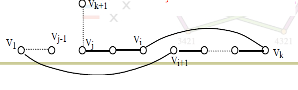

# 哈密顿图（H-图）

# 基础定义

* 哈密顿通路：包含$G$所有顶点的初级通路
* 哈密顿回路：包含$G$所有顶点的初级回路

  根据初级通路和初级回路的定义，哈密顿通路与哈密顿回路是互斥的概念！
* H-图：包含哈密顿回路的图$G$​
* 半H-图：不包含哈密顿回路且包含哈密顿通路的图$G$​

# H-图的必要条件

必要条件用于判断图$G$非H-图。

* 表述：$p(G-V')\le |V'|$，其中$V'\subset V(G)$

  显然从一个圈中删除$k$个点最多形成$k$个连通分支，而哈密顿图中所有顶点在一个圈上，因此得证

# H-图和半H-图的充分条件

> 基于朴素的事实考虑：若$G$中所有顶点对的度数之和足够大，则$G$连通。
>
> **本节内容频繁使用扩大路径证明法**。

* **条件**​**$*$**：n **（**​**$n\ge 2$**​ **）** 阶无向**简单图**​**$G$**中任意不相邻的顶点对$u,v$满足$d(u)+d(v)\ge n-1$
* ~引理1：满足条件$*$的图是连通图

  * 证明：反证法

    若$G$非连通，则可以取得$u,v$不在同一连通分支上，根据简单图的性质$d(u)+d(v)\le (n_1-1)+(n_2-1)=(n_1+n_2)-2=n-2$与已知条件矛盾
* ~引理2：若$G$满足条件$*$，$\Gamma$是不含$G$的所有顶点的极大路径（即$\Gamma=v_1v_2...v_k,k<n$），则$\Gamma$中所有顶点可构成初级回路

  * 证明：扩大路径证明法

    > $\Gamma=v_1v_2...v_k,k<n$，当$v_1,v_k$相邻时命题显然成立。
    >
    > 否则：设$T=\{v_j|v_j-v_k\},S=\{v_j|v_1-v_{j+1}\}$，则因为$v_1,v_k$不与$\Gamma$之外的点相连，故$|T|+|S|=d(v_k)+d(v_1)\ge n-1$，而因为$v_1,v_k$不相邻，所以$v_1\notin T\cup S$，所以$|T\cup S|\le k-1<n-1$，所以$|T\cap S|=|T|+|S|-|T\cup S|>(n-1)-(n-1)=0$，故可取$v_i \in T\cup S$，从而$v_1-v_{i+1}-v_{i+2}-...-v_k-v_i-v_{i-1}-..v_1$构成初级回路。
    >
    > ​​
    >

## 半H-图的充分条件

* 表述：若$G$非H-图且满足条件$*$，则$G$为半H-图。即：**若**​**$G$**​**满足条件**​**$*$**​ **，则**​**$G$**​**中的最大路径是哈密顿通路。**

  * 证明：反证法

    > 根据引理1，$G$为连通图；取$\Gamma=v_1v_2...v_k$为$G$的最大路径，并假设$k<n$，则根据引理2，$\Gamma$构成回路$C$，**因**​**$C$**​**不包含**​**$G$**​**的所有点但**​**$G$**​**又连通**，故必存在$v_{k+1}\notin C$，$v_{k+1}-v_j$（因为$v_1,v_k$不与$\Gamma$之外的点相邻，故$v_j$异于$v_1,v_k$，**从而删掉**​**$v_j$**​**在**​**$C$**​**上关联的一条边，就得到一条由**​**$v_1,v_2,...,v_k,v_{k+1}$**​**组成的路径**，它比$\Gamma$还长，所以与假设矛盾！因此$G$必为哈密顿通路。
    >
    > ​​
    >

## H-图的充分条件

* （**Ore定理**）表述：若$G$满足条件：**任意不相邻的顶点对**​**$u,v$**​**满足**​**$d(u)+d(v)\ge n$**，则$G$为H-图。

  * 证明：与引理2类似

    > 显然给定的条件是条件$*$的充分条件，因此**根据半H-图的充分条件**，**$G$**​**的最大路径为哈密顿通路**​**$\Gamma=v_1v_2...v_n$**，$v_1,v_n$不与$\Gamma$之外的点相邻（事实上也没有$\Gamma$之外的点）。
    >
    > $v_1-v_n$时命题显然成立；**否则设**​**$v_1,v_n$**​**不相邻。**
    >
    > 令$S=\{ v_j|v_j-v_n\}, T=\{v_{j}|v_1-v_{j+1}\}$，则$|S|+|T|=d(v_n)+d(v_1)\ge n$，而$v_n\notin S\cup T$，故$|S\cup T|<n$，$|S\cap T|=|S|+|T|-|S\cup T|>0$，则取$v_i \in S\cap T$，$v_i-v_n$且$v_1-v_{i+1}$，则$v_1-v_{i+1}-v_{i+2}-...-v_n-v_i-v_{i-1}-...-v_1$为哈密顿回路。
    >
* 推论（Dirac定理）若$\delta(G)\ge n/2$则$G$为H-图。

# H-图的一个充要条件

* （Bondy-Chvátal定理）给定简单图$G$（阶数$n\ge 3$），$G$为H-图$\Leftrightarrow$​$\hat G$为H-图

  其中$\hat G$为$G$的**闭图**，即不断连接$G$中满足$d(u)+d(v)\ge n$且不相邻的点$u,v$，直到不存在这样的点为止（构造闭图的过程一定可以结束，因为$K_n$中任意两个点相连）

* 只需要证明这个**引理**即可：给定简单图$G$（阶数$n\ge 3$），若$u,v\in V(G)$，$u,v$不相邻且$d(u)+d(v)\ge n$，向$G$添加一条关联$u,v$的边$e$，则**$G$**​**为H-图**​**$\Leftrightarrow$**​**$G+e$**​**为H-图**

  * 证明

    > $\Rightarrow$是显然的。
    >
    > $\Leftarrow$：$G+e$有哈密顿回路$C$。若$C$不包含$e$，则也有$C\subseteq G$，从而$G$为H-图；否则若$C$包含$e$，则只能说明$\Gamma=C-e \subseteq G$，$\Gamma$为哈密顿通路。但是，因为$\Gamma$显然是最大路径，其端点（即$e$的端点$u,v$）不相邻且满足$d(u)+d(v)\ge n$，直接**由Ore定理的证明过程得到**​**$G$**​**为H-图。**
    >

‍
