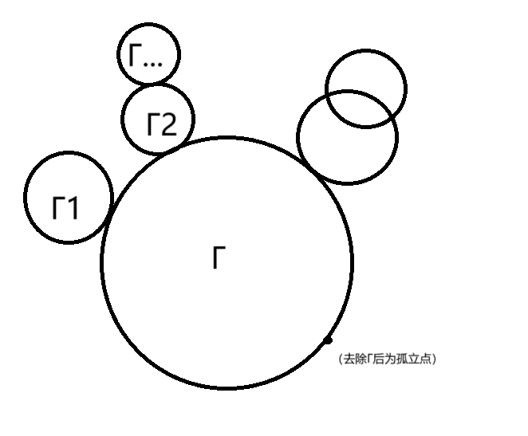

# 欧拉图（E-图）

# 基础定义

* 欧拉通路：经过图$G$每条边的**简单通路**
* 欧拉回路：经过图$G$每条边的简单回路

  > **注意：在该定义下欧拉回路包含于欧拉通路之中！**
  >
* 欧拉图：含有欧拉回路的图$G$（约定平凡图为欧拉图）
* 半欧拉图：**不含欧拉回路**但含欧拉通路的图$G$

# 欧拉图判定定理

* 表述：$G$为欧拉图$\Leftrightarrow$​$G$为连通图且**所有点的度数均为偶**
* 证明：

  * $\Rightarrow$：显然成立

    首先根据欧拉回路的定义，$G$必须连通；其次$G$的每个点$v$在回路上每出现一次，对$d(v)$贡献为2（进一次出一次），又因为欧拉回路包含了图中所有边，所以$d(v)$必为偶数。
  * $\Leftarrow$：通过下面两步证明（均使用数学归纳法）

    * 引理1：$G$连通且个顶点均为偶度$\Rightarrow$​**$G$**​**中所有边包含在若干**​<u>**边互不相交**</u>​**的初级回路中**（可共有顶点！）

      > 对边数$m$做归纳
      >
      > 归纳奠基：$m=1$时连通图$G$只有一个顶点$v$，且成一环，边含在初级回路$v-v$中。
      >
      > 归纳假设：假设$m\le k$时命题成立。
      >
      > 归纳步骤：$m=k+1$时，
      >
      > * **<u>因为</u>**​**<u>$\delta(G)>1$**</u>​ **<u>，</u>**​**<u>$G$**</u>​**<u>中必含初级回路</u>**（应用3扩大路径证明法[^1]：取$G$中一极大路径，端点为$u,v$，因$u$不与路径之外的任何点相邻，则$u$必与路径上两点相邻，构成初级回路$u-u_1-...-u_k-u$），记作$\Gamma$，
      >
      > 则$G-E(\Gamma)$中含有$s$个连通分支，因为在$\Gamma$中出现的点**在以上减边操作中度数的损失量均为2**，故$G-E(\Gamma)$中各顶点仍为偶度，且各连通分支$G_1,...,G_s$所含边数必$\le k$，由归纳假设它们的边包含在若干个边互不相交的初级回路$\Gamma_1,...,\Gamma_t$中（如果不含边，则说明该连通分支是孤立点，不考虑即可），且显然与$\Gamma$也是**边互不相交**的。**从而**​**$G$**​**的边也包含在若干**​**<u>边互不相交</u>**​**的初级回路中**。归纳得证。
      >

      ​​
    * 引理2：若$G$连通且所有边包含在若干边互不相交的初级回路中，则$G$中含欧拉回路。

      > 证明：采用与引理1相同的模式，做数学归纳
      >
      > 归纳奠基：环含有欧拉回路；孤立点规定为欧拉图，也认为它有“欧拉回路”（以自身为起点和终点的长度为0的空回路）。
      >
      > 归纳假设：$m\le k$时命题成立。
      >
      > 归纳步骤：在$\Gamma$上任取一点开始遍历，每走到$\Gamma$与$G-E(\Gamma)$某一连通分支的交点处（$\Gamma$与$G-E(\Gamma)$各连通分支$G_1,...,G_k$都有交点，因为$G$为连通图），如果该连通分支还没有遍历过，就遍历该连通分支，由归纳假设该连通分支有欧拉回路，则从交点处进入可以遍历该连通分支然后从原处出来，最后回到$\Gamma$上的起点，这就完成遍历构造了$G$的欧拉回路。归纳得证。
      >
* 结论：若$G$为非平凡连通图，则以下三个命题等价：

  * $G$为欧拉图
  * $G$所有顶点度数为偶
  * $G$中所有边包含在若干**边互不相交**的初级回路中

# 半欧拉图判定定理

* 表述：$G$为半欧拉图$\Leftrightarrow$​$G$为连通图，且恰有2个奇度顶点，其他顶点均为偶度

  $\Rightarrow$：显然$G$是连通的；根据欧拉通路（非欧拉回路）的定义，欧拉通路的两个端点在两端出现对其度的贡献为1，在通路内部出现每次对其度的贡献为$2$，而其他点只在通路内部出现，每次对其度的贡献为$2$。累加起来即得证。

  $\Leftarrow$：给两个奇度顶点连一条边$e$，则$G+e$满足欧拉图判定定理的条件，$G+e$为欧拉图，则$G+e$有一条欧拉回路（必包含边$e$），根据简单回路去一边得到简单通路的原理，该欧拉回路去掉$e$就得到$G$的欧拉通路，又因$G$有奇度顶点不满足欧拉图判定定理的条件，因此$G$不含欧拉回路且含欧拉通路，故$G$为半欧拉图。

# 欧拉图的性质

* ~欧拉图中**无桥**

  直观证明：对于欧拉图$G$中任一边$e$（端点为$u,v$），欧拉回路$\Gamma$包含$e$，则$G-e$有欧拉通路$\Gamma$，因此$G-e$仍然连通，从而$e$不是桥。

  另一证明：$G$为欧拉图故所有点度数为偶，如果有桥$e$，则$G-e$含两个连通分支$G_1,G_2$，它们各自有唯一的奇度顶点，这与握手定理的推论矛盾（奇度顶点的个数为偶）。

# 欧拉回路的构造算法：Fleury算法

* 初始化：任取$v_0\in V$，令简单通路$P=v_0$（为空）
* 当$P=v_0e_1v_1...e_iv_i$时：取$e_{i+1}\in E-\{e_1,...,e_i\}$使得

  * $e_{i+1}$与$v_i$相关联
  * 除非别无选择，否则$e_{i+1}$不应是$G-\{e_1,...,e_i\}$的割边
* 重复以上步骤直到$P$不能再延长，算法结束

[^1]: # 3扩大路径证明法

    基本思想：构造极大路径、最大路径，**使得端点具有特殊性质——不与路径之外的点相邻**，从而在路径上**充分利用端点的度数**连接端点与路径内部的点，构造所需结构。

    # 基础定义

    * 极大路径：图$G$中的一条路径$\Gamma$，使得其端点$u,v$均不与$\Gamma$以外的顶点相邻
    * 最大路径：最长的极大路径

    # 应用

    （有时候为了保证条件足够强，需要取最大路径）

    * ~若$G$为简单图，$\delta(G)=k$，则$G$中必包含长度不小于$k+1$的初级回路

      证明：取$G$中一极大路径，端点为$u,v$，因为极大路径的端点不与路径之外的任意顶点相邻，故$u$至少与该路径上$k$个其他点相邻（其中一定与路径上$u$的下一个点$u_1$相邻），故在**路径上离**​**$u$**​**最远**且**与**​**$u$**​**相邻的点**​$w$，它**在路径上离**​**$u$**​**的距离不小于**​**$k$**，将它与$u$相连，$u-u_1-u_2-...-u_{k-1}-w-u$就是一条长度不小于$k+1$的初级回路。
    * ~若$G$为简单图，$\delta(G)\ge 3$，则$G$中一定存在偶圈

      证明：取$G$中一极大路径，端点为$u,v$，则因为$u$不与极大路径之外任意点相邻，则$u$至少与它在路径上下一个点$u_1$，以及$u_1$下游另外两个点$x,y$相邻。若路径上$u$到$x$的距离为奇数，则$u-u_1-...-x-u$即为偶圈；对于$y$同理。于是只需考虑在路径上$u$到$x$，$y$的距离均为偶数的情况，显然此时$x,y$之间的举例也是偶数，则$u-x-u_m-...-u_n-y-u$即为偶圈。综上必存在偶圈。

    ‍
