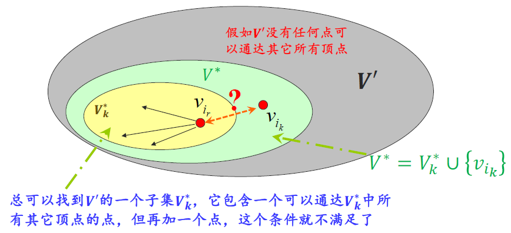
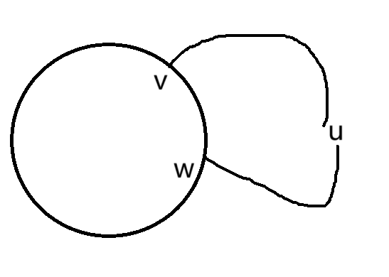

# 6.1有向图的连通性

# 单向连通、强连通的充要条件

* 定义

  * 弱连通：有向图$D$的底图$G$为连通图
  * 单向连通：$\forall u,v \in V(D)$，$(u,v)$-有向通路和$(v,u)$-有向通路**至少有一个存在**
  * 强连通：$\forall u, v\in V(D)$，$(u,v)$-有向通路和$(v,u)$有向通路**均存在**
* **~单向连通的充要条件**：$D$单向连通$\Leftrightarrow$​$D$的所有点在同一个**有向通路上**

  * ~引理：$D$单向连通$\Rightarrow$​**$\forall V'\subseteq V(D)$**​ **，**​**$\exists v'\in V'$**​ **，**​**$v'$**​**可达**​**$V'$**​**中的所有点**（且约定顶点到其自身是可达的）

    > 证明：反证法，设存在$V'\subseteq V(D)$，$\forall v' \in V'$，**$v'$**​**不可达**​**$V'$**​**的所有点。**
    >
    > 考虑如下事实：不断地从$V'$中移除点依次得到子集$V^{(2)},V^{(3)},...,V^{(k)}$，因为最极端情况下得到子集只剩1个点时它到自己是可达的，则$V'$必然有一个极小子集$V^*$：$V^*=\{v_{i_1},...,v_{i_k}\}$中没有可达所有顶点的点，但$V_k^*=V^*-\{v_{i_k}\}$中存在$v_{i_r}$可达$V_k^*$中的所有顶点。那么在$V^*$中$v_{i_r}$唯一不可达的点就是$v_{i_k}$，则发现：
    >
    > * 不存在$(v_{i_r},v_{i_k})$-有向通路（因为$v_{i_r}$到$v_{i_k}$是不可达的，否则$v_{i_r}$可达$V^*$中所有点，矛盾）
    > * 不存在$(v_{i_k},v_{i_r})$-有向通路（否则$v_{i_k}$可通过$v_{i_r}$到达$V^*$中的其余点，这与已知矛盾）
    >
    > **因此**​**$D$**​**非单向连通！** 反证完成。
    >
    > ​​
    >
  * 证明本定理：

    > $\Leftarrow$显然。
    >
    > $\Rightarrow$：取$V_1=V(D)$，$v_1 \in V_1$可达$V_1$中所有点，然后取$V_2=V_1-\{v_1\}$，$v_2\in V_2$可达$V_2$中所有点，依此类推，得到$v_1\to...\to  v_2\to ...\to v_n$就是一条包含$D$的所有点的**有向通路**。
    >
    > 注意：只保证是有向通路，不一定是简单通路、初级通路，**里面节点可能反复出现！**
    >
* **~强连通的充要条件**：$D$强连通$\Leftrightarrow$​$D$的所有点在同一个**有向回路上**

  * 证明：

    > $\Leftarrow$显然。
    >
    > $\Rightarrow$：根据强连通的定义，取$\Gamma_1,\Gamma_2,...,\Gamma_n$分别为$(u_1,u_2),(u_2,u_3),...,(u_{n-1},u_n),(u_n,u_1)$-有向通路，则将它们首尾相连就得到一个有向回路。
    >

# 无向图的边定向

* 无向图$G$可以通过边定向成为强连通的有向图$D$​$\Leftrightarrow$​**$G$**​**是2-边连通的**

  * 证明：

    > $\Rightarrow$：反证法。若$G$非2-边连通，即$\lambda(G)\le 1$，则$G$为非连通图时$G$如何定向得到的$D$都非连通有向图；或者有割边$e$，则$G-e$有$G_1,G_2$两个连通分支，分别取其中的$v_1,v_2$，则只要$e$定向，$(v_1,v_2)$-有向通路和$(v_2,v_1)$-有向通路不可能同时存在，即$D$不可能是强连通的。
    >
    > $\Leftarrow$：类似前面的证明[^1]（扩大路径证明法），由$\lambda (G)\ge 2$可以得出**$G$**​**中至少含有一个回路**​**$C$**。又任取不在$C$上的一点$u$，可以在$C$上任取$v,w$两点，它们必然都与$u$之间有通路。由此可构造包含所有点的有向回路（不要求为简单或初级通路）：
    >
    > ​​
    >
    > $$
    > v\to ...(外侧)\to w\to... u_1...\to v\to...(内侧)...\to w\to ...u_2...\to ...
    > $$
    >
    > 可以一直这样下去反复兜圈子，直到把$C$之外的点全部兜完，得到一个包含所有点的有向回路，根据强连通判定定理将用到的边全部按顺序定向（其余边随意定向）之后，就得到一个强连通的有向图。
    >

‍

[^1]: * **<u>因为</u>**​**<u>$\delta(G)>1$**</u>​ **<u>，</u>**​**<u>$G$**</u>​**<u>中必含初级回路</u>**（应用3扩大路径证明法[^2]：取$G$中一极大路径，端点为$u,v$，因$u$不与路径之外的任何点相邻，则$u$必与路径上两点相邻，构成初级回路$u-u_1-...-u_k-u$），记作$\Gamma$，
