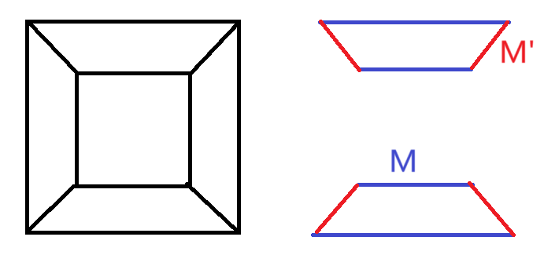

# 7二部图及其匹配

> 注意：表示结构对象的尖括号中元素顺序不能随意改变。
>
> 例如，二部图$\langle V_1,V_2,E\rangle$与$\langle V_2,V_1,E\rangle$是不相等的。图$\langle V,E\rangle$中点集与边集顺序固定，不能随意交换；在代数系统的表示中同理。

# 二部图的判定定理

* 表述：**简单图**​**$G$**是二部图$\Leftrightarrow$​**$G$**​**中不存在长度为奇的圈（初级回路）**
* 证明：

  > $\Rightarrow$：不失一般性，从$v_1\in V_1$出发，因为每条边连接$V_1,V_2$中的一对顶点，故由$v_1$延伸出的路径长度为奇数时末端必为$V_2$中顶点，不可能以$v_1$为末端构成圈。从而$G$中无奇圈。
  >
  > 或：回路$C=v_0v_1...v_tv_0$，$v_0\in V_1\Rightarrow v_t\in V_2$，则$v_1,v_t$间路径长度为偶，则$t$为奇数，则$C$长度$t+1$为偶数。
  >
  > $\Leftarrow$：
  >
  >> 要证明的是图具有高度特殊性结构（二部图），不能仅仅用构造法，要**结合反证法**。
  >>
  >
  > 若$G$为连通图则讨论$G$本身，否则下面只讨论$G$的单个连通分支（显然若非连通图各个连通分支为二部图，则它也是二部图）。
  >
  > 取$v_0\in G$，$d(v_0,v)$表示$v_0,v$之间<u>路径</u>长度（根据路径存在定理知路径存在），规定$d(v_0,v_0)=0$。$V_1=\{v|d(v_0,v)为偶\},V_2=\{v|d(v_0,v)为奇\}$则$V_1\ne \varnothing, V_2\ne\varnothing, V_1\cup V_2=V, V_1\cap V_2=\varnothing$，若$\exist v_1,v_2\in V_1 \ s.t.\ v_1-v_2$，则$v_0-...-v_1-v_2-...-v_0$长度为$d(v_0,v_1)+d(v_0,v_2)+1$为奇数，易见：$v_0,v_1$-路径与$v_0,v_2$-路径不相交于$v_0$之外的点时该回路为圈；相交时取它们离$v_0$最远的交点$v_0'$，$v_0'-...-v_1-v_2-...-v_0'$就是一个圈，且<u>显然两路径上的两条</u>​$v_0'-v_0$子路径长度奇偶性相同，故减去的边数为偶数，圈与原回路的长度奇偶性相同。总之存在奇圈，与已知矛盾！同理可证$V_2$中不存在相邻顶点。从而$G=\langle V_1,V_2,E\rangle$为二部图。
  >

‍

# 二部图匹配的基础定义

* 匹配$M$：$M\subseteq E$且$M$中的边两两无公共端点
* 极大匹配：匹配$M$再往里面加任意一条边都不成匹配了
* 匹配数$\beta_1(G)$​：**图**​**$G$**​**匹配能含有的最大边数**
* 最大匹配：$M$在所有匹配中含有最大边数，即$|M|=\beta_1(G)$
* $M$-饱和点：被$M$中边关联的点。反之为$M$-非饱和点
* **完备匹配**：$G=\langle V_1,V_2,E\rangle$，<u>$|V_1|\le |V_2|$</u>，$V_1$中所有点都是$M$-饱和点则称$M$为完备匹配（显然完备匹配是$G$上一个最大匹配）
* 完美匹配：匹配$M$使得$G$中所有点都是$M$-饱和点（显然完美匹配是最大匹配）。$|V_1|=|V_2|$时完备匹配成为完美匹配
* （$M$-）交错路径（交错路）：$M$中边与非$M$中边交替出现的路径
* **可增广交错路径（可增广路）：** 第一条和最后一条边均非$M$中边的路径（显然该路径长度必为奇数）
* 增广交错路径（增广路）：对可增广路进行翻转（改变路径上每条边在$M$中的状态）得到的路径，其包含$M$中边数是原先可增广路的+1

  > 可增广交错路径要求路径两端都是非$M$饱和点，在路径上翻转每条边是否在$M$中的状态实现增广。**通过环和（对称差）实现**：$E_p,M_p$分别是可增广路上所有边和$M$中边的集合。$M_p'=E_p\oplus M_p=(E_p-M_p)\cup(M_p-E_p)=E_p\cup M_p-E_p\cap M_p$。（显然：$E_p-M_p$就是原先可增广路上不在$M$中的的边，而$M_p-E_p$为空，使用对称差只是因为可以用交、并运算代替差集运算，更方便）
  >

# 二部图匹配相关定理

* **Berge定理：**​**$M$**​**是**​**$G$**​**上的最大匹配**​**$\Leftrightarrow$**​**$G$**​**不含**​**$M$**​ **-可增广路**

  * 证明：

    > $\Rightarrow$：用反证法。若$G$含有$M$-可增广路，则执行增广操作得到比$M$更大的匹配，从而$M$不是最大匹配。
    >
    > $\Leftarrow$：取一个最大匹配$M'$，$H$为$M\oplus M'$的诱导子图（即由边集$M\oplus M'$导出其关联的点集。
    >
    > ​​
    >
    > * 若$H=\varnothing$，说明$M-M'=M'-M=\varnothing$即$M=M'$，则$M$为最大匹配
    > * 否则：因为$M,M'$均为匹配，**$H$**​**中不可能有**​**$\ge 3$**​**度的顶点**（$\forall v \in V(H)$，$v$在$M,M'$中各最多只有一条关联的边，故在$E(H)=M\cup M'$中最多关联2条边）。<u>则</u>​**<u>$H$**</u>​**<u>的每个分支必为交错回路或交错路</u>**​<u>，</u>​**<u>且</u>**​**<u>$H$**</u>​**<u>中取自</u>**​**<u>$M,M'$**</u>​**<u>的边数一样多</u>**（否则$M,M'$有一不为匹配或在$G$中有可增广路与已知矛盾），即$|M-M'|=|M'-M|$，根据差集的含义$|M|=|M'|$，故$M$为最大匹配。
    >
    > 注意：充分性的证明中用到了必要性！取已有的最大匹配$M$，根据必要性$G$中不含$M$-可增广交错路，又由充分性$M'$-可增广交错路也不存在，从而保证论证。
    >
* Hall定理（**存在完备匹配的充要条件**）：二部图$G=\langle V_1,V_2,E\rangle (|V_1|\le|V_2|)$有完备匹配$\Leftrightarrow$​$\forall V'\subseteq V_1, |N(V')|\ge |V'|$

  且：当且仅当$G$有完备匹配且$|V_1|=|V_2|$时，$G$有完美匹配。

‍
