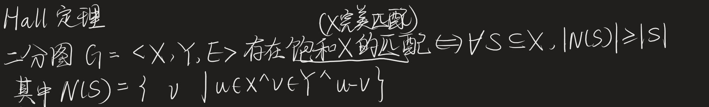
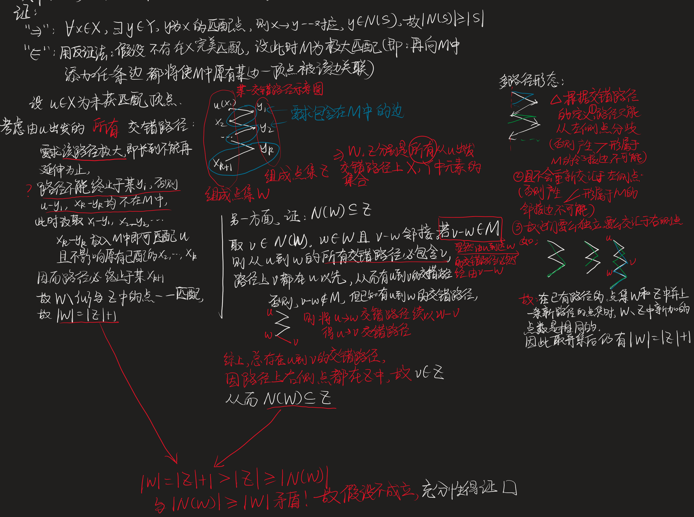
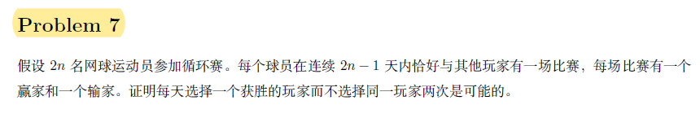

# *拓展知识学习

* 二部图的最大匹配问题

  * **~Hall定理**

    ​​

    * 证明：

      ​
    * 例题

      * PS15A P7

        ​​

        关键点：

        ①正确建构恰当的模型，用二部图表示：$d_i$与$v_j$相连表示第$i$天运动员$j$为赢家，则每个$d_i$都必然与$n$个$v_j$相邻，要证明该图总存在合法的饱和$D$（代表$2n-1$天的点集合）的匹配，从而联系到利用Hall定理的充分性条件。

        ②思想：极端原理。

        ③**合理分析不等式关系，充分利用问题情景下隐含的限制条件**。

* 图染色问题
