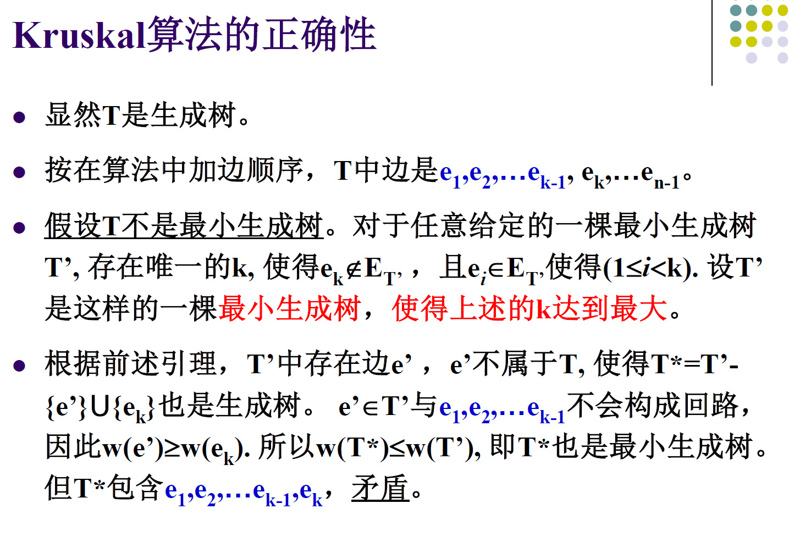

# 8.1最小生成树

# 基础

* 生成树：若$G$的生成子图$T$（即：$V(T)=V(G),E(T)\subseteq E(G)$）是树则称$T$为生成树
* 子图的权：带权图$G=\langle V,E,W\rangle$的子图$G'$的权$W(G')$为其各边权之和。
* 最小生成树：$T$满足$W(T)\le W(T')$，$T'$为$G$的任一生成树
* ~生成树存在定理：简单图$G$有生成树$\Leftrightarrow$​$G$为连通图

  * 证明：

    > $\Rightarrow$：显然成立。
    >
    > $\Leftarrow$：因为树是无回路简单连通图，故只要$G$中有回路就去除回路上一边直到$G$中无回路，得到生成树。此为<u>破圈法</u>。
    >
  * 推论：简单图$G$是树$\Leftrightarrow$​$G$有唯一生成树

    > $\Rightarrow$：显然：没有任何圈需要破，$G$是其自身的生成树。
    >
    > $\Leftarrow$：若$G$不是树，则$G$有回路，在回路上不同位置破圈必然得到不同的生成树，与$G$有唯一生成树矛盾。
    >

# *生成树计数

* *Cayley定理：$\tau(K_n)=n^{n-2}$（不同的生成树个数：只要有边不同即视为不同）
* $\tau(K_{p,q})=p^{q-1}q^{p-1}$

较小的图的生成树计数求解：

* e.g. $K_4$：生成树边数为$4-1=3$，任取被标定的$K_4$的3条边，有$C_6^3$种；其中当且仅当取定的边不成回路时得到的是树，故要排除4种三角形+孤立点的情况。总共$C_6^3-4=16$种。

# Kruskal算法

## 算法流程

初始化$T=\varnothing$（空图）。重复$n-1$次下列操作：每次取满足下列条件的边：

* $e\in E-E(T)$且$W(e)$最小
* $T+e$中无回路

每次将$e$加入$T$，$n-1$次重复结束时$T$就是最小生成树。

## 正确性证明

> 假设Kruskal算法的输出$T$不是最小生成树，其边按添加顺序为$e_1,e_2,...,e_{n-1}$（显然$e_i\le e_j$当$i<j$），设$T_k$为一最小生成树，其边按非递减顺序排列满足第$1,2,...,k-1$边与$T$相同但第$k$边与$T$不同。**令**​**$T'$**​**为**​**$k$**​**最大的这样的**​**$T_k$**。其边列举出来为$e_1,e_2,...,e_{k-1},e_k',...,e_{n-1}'$。
>
> 根据树的定义$T'+e_k$有唯一回路$C$，$e_k$引入了$C$所以$e_k$在$C$上，此外**$C$**​**上不能只含**​**$T$**​**的边（否则**​**$C\subseteq T$**​**与**​**$T$**​**为树矛盾）** ，故存在$e'_t$在$C$上，且$e_t'\notin T$。因此$T^*=T'+e_k-e_t'$先引入$C$后又破$C$，是一个生成树，且$W(T^*)=W(T')+W(e_k)-W(e_t')$。因为Kruskal算法每次选边为当前不产生回路的最小边，必有$W(e_k)\le W(e_k')\le W(e_t')$，从而$W(T^*)\le W(T')$，则$T^*$也是一个最小生成树，但**根据定义**​**$T^*=T_m,m\ge k+1$**（因为$e_1,...,e_k$都是$T^*$的边），这与前面设$k$最大矛盾！

* 正确性证明（PPT）：

  * ​​

    这里构造的$uv$-通路是初级通路（路径）：根据路径存在性定理得到。因为其中$u,v$分别属于$T_1,T_2$，
  * ​​

## 类似命题的证明（PS）

* 若带权连通图$G$各边权不相同，则其最小生成树是唯一的。

  [所有边权均不相同的无向图最小生成树是唯一的证明_各边权值互不相等最小生成树-CSDN博客](https://blog.csdn.net/gyarenas/article/details/42245119)
