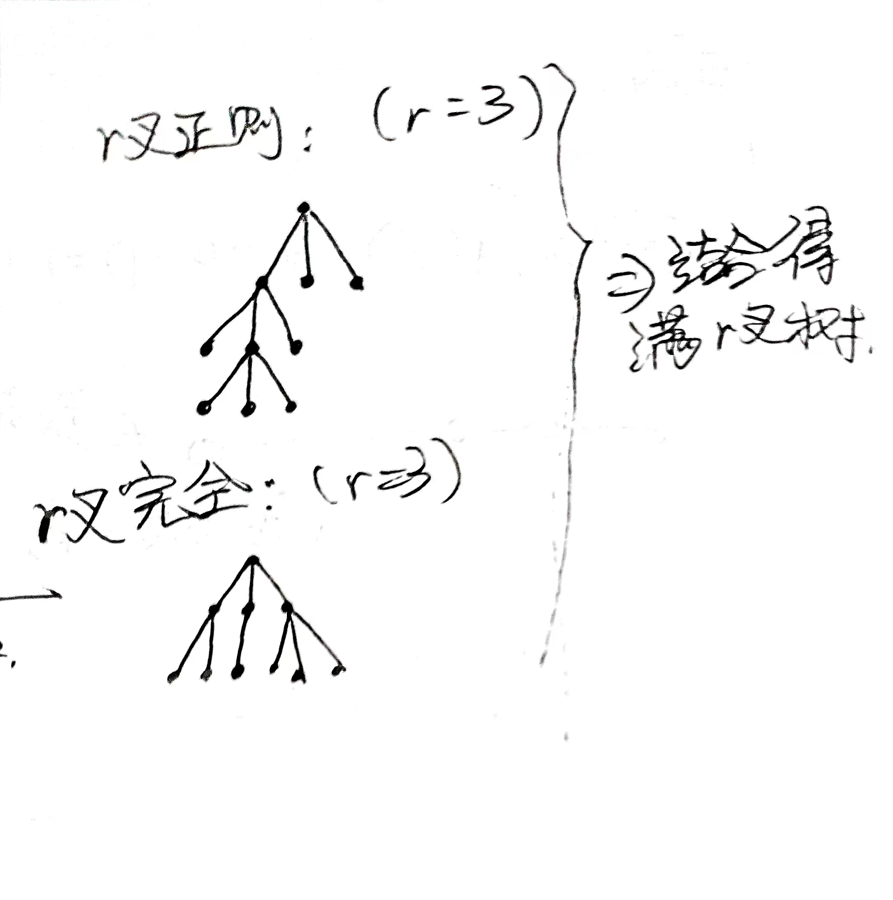

# 8.2 根树 二叉树

# 基础定义

* 有向树：底图为树的有向图
* 根树：满足以下条件的有向树：

  1. $\exists ! v \in V(T)$使得$d_-(v)=0$（称$v$为根）
  2. $\forall v\ne u\in V(T)$，$d_-(u)=1$​
* ~根据根树的定义，根树$T$中存在**唯一**​$(v,u)$-有向通路而不存在$(u,v)$-有向通路

  * 若不存在$(v,u)$-有向通路，由于底图为树，必然存在底图上$v,u$-路径上的点，在**$T$**​**中入度**​**$>1$**（路径中间某个点只进不出导致有向通路不存在）
  * 若存在$>1$条$(v,u)$-有向通路，则必然导致有点入度$>1$（两有向通路要么在$u$汇合，要么在$u$以前的某点汇合）
  * 若存在$(u,v)$-有向通路则不满足$d_-(v)=0$
* 根树的层计数

  * **根层为第0层**，其他节点的层数为根到它的有向路径的长度
  * 根树的深度/树高为最大层数
* **根树性质术语**

  * 有序：**同层**的每个节点排定次序（不只是亲兄弟！）
  * $r$叉：每个分支节点至多有$r$个子节点
  * $r$叉正则：每个分支点恰有$r$个子节点
  * 完全：每个叶节点高度恰等于树高（即所有叶节点长在同一层）
  * 概念辨析：

    ​

# 特殊的二叉树的定义

* 有序二叉树是一种特殊的有序$r$叉树，同层节点的序可以用左右子节点、左右子树来表示。

* 二叉搜索树：是有序二叉树，每个顶点$u$有唯一标号，且**$u$**​**的标号大于其左子树中任意节点的标号、小于其右子树中任意节点的标号**
* 平衡二叉树：任一顶点左右子树高度差不大于1
* 最优二叉树

  * 二叉树的权：所有叶节点为$v_1,...,v_t$，分别对应数值权$w_1,...,w_t$，$l(v)$表示$v$的深度，则$W(T)=\sum _{i=1}^tw_il(v_i)$
  * 最优二叉树：**具有相同权序列**（即叶节点个数相同并且各自的叶节点权值单调排列时完全相同）的二叉树中权最小的一个（不唯一）
  * ~最优二叉树必为正则二叉树，即不能有链状部分

    若有链状部分，必可以<u>删除掉链上的内点</u>从而将链末端的叶节点往浅层移动，使得$W(T)$减小

# 最优二叉树的应用：前缀码

* 前缀码：给定码表$A=\{\beta_1,...,\beta_m\}$使得任意的$\beta_i,\beta_j(i\ne j)$互不为前缀。
* Huffman算法：求最优二叉树

  1. 初始化：给定$v_1,...,v_t$共$t$个孤立点，各自有数值
  2. 每次从目前的树中**取其根的数值最小的两个**，将两树的根连接到一个新的根上并将新根的数值设置为两根数值之和（也就是该树所有叶子节点的数值之和）
  3. 重复操作$t-1$次，将所有点合并成一棵二叉树，算法结束
* 应用Huffman算法：初始时各点的数值设为要编码的字符的出现频率。每次合并时左、右子树的根分别标0、1。最终得到的前缀码树$T$就是$W(T)$最小的最优二叉树，依次读出从根到叶节点的0、1标号就是字符对应的前缀码。

# *根树的遍历

* 二叉树的遍历：前序（先根后左右子树）、中序（左子树根右子树）、后序（先左右子树后根）
* 逆波兰表示法

‍
